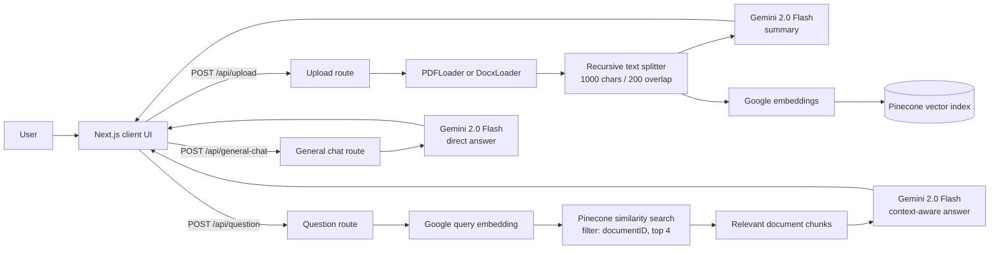

# Docs Assistant

Docs Assistant is a web application for understanding documents through natural-language conversation. A user can upload a PDF or DOCX file, receive an AI-generated summary, and ask follow-up questions grounded in the uploaded document. The application also provides a general-purpose chat mode when no document is selected.

## Problem Statement

Long documents are difficult to search and understand quickly. Users often need to locate a specific fact, clause, or explanation without reading an entire file or manually searching through multiple pages. Docs Assistant addresses this problem by:

- Accepting PDF and DOCX uploads through a drag-and-drop interface.
- Extracting and splitting document text into searchable chunks.
- Generating a structured summary with Google Gemini.
- Creating embeddings and storing chunks in Pinecone for semantic search.
- Retrieving relevant chunks when a user asks a document-specific question.
- Generating an answer from the retrieved context instead of sending the whole document to the model.

## Features

- PDF and DOCX upload with a 20 MB client-side size limit.
- AI-generated document summary after upload.
- Document-grounded question answering using retrieval-augmented generation (RAG).
- General AI chat without an uploaded document.
- Markdown rendering with GitHub-flavored Markdown, syntax highlighting, mathematical notation, emoji, heading links, and sanitization.
- Light and dark themes.
- Chat history for the current browser session and a clear-history action.

## Architecture



### Request flow

1. The browser sends the selected file to `/api/upload` as `multipart/form-data`.
2. The upload route parses the file, creates a UUID, and adds that UUID to every chunk's metadata.
3. Gemini summarizes the first extracted document section, while Google embeddings represent all chunks as vectors.
4. Pinecone stores the vectors and metadata. The returned document ID connects the UI to those stored chunks.
5. A document question is embedded and used for similarity search. The search is filtered by the document ID so results come from the selected document.
6. The retrieved chunks and question are sent to Gemini to produce the final answer.

## Technology Stack

| Technology | Purpose | Why it is used |
| --- | --- | --- |
| Next.js 15 | Full-stack React framework and API routes | Keeps the web UI and server endpoints in one application with a straightforward deployment model. |
| React 19 + TypeScript | Interactive UI and static typing | Supports component-based stateful interfaces and catches type errors during development. |
| Tailwind CSS 4 | Styling and responsive layout | Enables consistent utility-based styling without maintaining a large custom stylesheet. |
| LangChain | Document loading, splitting, embeddings, and vector-store integration | Provides standard building blocks for the RAG pipeline. |
| Google Gemini 2.0 Flash | Summarization and answer generation | Provides fast general-purpose language generation for summaries and chat answers. |
| Google `embedding-001` | Text and query embeddings | Converts document chunks and questions into vectors that can be compared semantically. |
| Pinecone | Vector database | Stores embeddings and supports similarity search with document metadata filtering. |
| `react-dropzone` | File selection and drag-and-drop | Provides a clear upload interaction and client-side file validation. |
| `react-markdown` and remark/rehype plugins | Rich answer and summary rendering | Displays structured AI responses while sanitizing rendered content. |
| Radix UI and Lucide React | Accessible UI primitives and icons | Provides reusable interaction primitives and consistent visual controls. |
| `next-themes` | Theme switching | Supports light, dark, and system theme preferences. |

## Core Concepts Used

### Retrieval-Augmented Generation (RAG)

The document question route first retrieves relevant chunks from Pinecone, then gives those chunks to Gemini as context. This helps keep answers tied to the uploaded document.

#### RAG workflow in this project

RAG combines information retrieval with generative AI. Instead of asking the language model to answer from its training data alone, the application retrieves relevant passages from the uploaded document and includes them in the prompt used to generate the answer.

1. **Ingest:** `/api/upload` parses the PDF or DOCX file.
2. **Chunk:** LangChain splits extracted text into 1,000-character chunks with 200 characters of overlap.
3. **Embed:** Google `embedding-001` converts each chunk into a numerical vector.
4. **Index:** Pinecone stores each vector with a generated `documentID`.
5. **Retrieve:** `/api/question` embeds the user's question and returns the four most similar chunks, filtered by `documentID`.
6. **Generate:** Gemini receives the question and retrieved text and produces the answer shown in the chat interface.

The overlap reduces the chance that a sentence or clause split across two chunks loses its surrounding context. The document filter is also important: it prevents a question about the selected upload from retrieving chunks belonging to another upload.

#### Benefits and risks

RAG can improve factual grounding, reduce the amount of text sent to the model, and make long documents searchable. It does not guarantee a correct answer. Retrieval quality depends on chunk size, embeddings, metadata filters, and the similarity-search limit. This implementation also summarizes only the first extracted chunk during upload, while question answering searches all indexed chunks.

### Sentiment analysis

Sentiment analysis is the process of classifying text according to its emotional or evaluative tone. A typical output contains a label such as `positive`, `neutral`, or `negative`, along with a confidence score. A more useful customer-support version can also detect emotions such as frustration, satisfaction, urgency, or confusion and extract the topic being discussed.

Sentiment analysis is **not currently implemented** in this repository. The existing general-chat and document-question routes send text to Gemini for an answer, but they do not request, validate, store, or display a sentiment result.

#### Suggested implementation for Docs Assistant

Sentiment could be analyzed for each user message before or alongside the chat request:

1. Receive the user's message in the server route.
2. Ask a model or a dedicated classifier for strict JSON containing `label`, `score`, `emotion`, and optional `topic` fields.
3. Validate the response against a schema and store the result with the chat message if history or analytics are added.
4. Use the result to adapt the assistant's tone, flag urgent negative feedback, or summarize the overall sentiment of a document review session.

Example result:

```json
{
  "label": "negative",
  "score": 0.91,
  "emotion": "frustration",
  "topic": "delivery delay"
}
```

Sentiment should be treated as an estimate rather than a fact. Sarcasm, mixed opinions, domain-specific language, and short messages can produce unreliable classifications. User consent and privacy controls are also needed before retaining message-level sentiment data.

### Product recommendation system

A product recommendation system selects and ranks products that may be relevant to a user. It normally uses a product catalog, user preferences, browsing or purchase events, and contextual signals such as the current question or uploaded document.

Product recommendations are **not currently implemented** in this repository. The application has no product data model, user accounts, interaction-event store, recommendation route, or ranking logic. Pinecone is used for document chunks, but that alone is not a product recommendation system.

#### Suggested architecture

For a future product-aware version, the system could use a hybrid approach:

1. **Catalog data:** Store product ID, name, description, category, price, availability, and attributes in a database.
2. **Product retrieval:** Create embeddings for product descriptions and use semantic search to find products related to the user's question or document.
3. **Personalization:** Combine semantic relevance with explicit preferences and events such as views, likes, carts, and purchases.
4. **Ranking:** Apply business rules for availability, price range, safety, and diversity, then rank the remaining candidates.
5. **Explanation:** Return the product, a relevance score, and a short reason grounded in the matching product attributes.

A simple hybrid ranking formula could be:

```text
finalScore = 0.50 * semanticSimilarity
           + 0.25 * preferenceMatch
           + 0.15 * popularity
           + 0.10 * businessRuleScore
```

The weights should be evaluated against recommendation metrics such as precision@k, recall@k, click-through rate, conversion rate, and coverage. Recommendations should never suggest unavailable products, expose another user's activity, or use sensitive attributes without a clear and justified policy.

#### Relationship to RAG

RAG answers questions using retrieved document passages. A recommendation system retrieves and ranks products for an action. They can be combined: a user might ask a question about an uploaded product guide, RAG can ground the explanation in that guide, and a separate recommendation pipeline can select products whose catalog attributes match the user's needs. Keeping document chunks and product records in separate namespaces or indexes helps prevent unrelated retrieval results from being mixed.

### Text chunking

Documents are split into chunks of up to 1,000 characters with 200 characters of overlap. Chunking makes large documents searchable and overlap helps preserve context that crosses chunk boundaries.

### Embeddings and semantic search

Embeddings represent text as numerical vectors. Pinecone compares the question vector with stored document vectors, returning the four most similar chunks rather than relying only on exact keyword matches.

### Metadata filtering

Each chunk receives a generated `documentID`. The question route filters Pinecone results using that ID so a question about one upload does not retrieve chunks belonging to another upload.

### Client and server separation

The page and chat interface manage UI state in the browser. API routes keep model calls, document parsing, API keys, and vector database access on the server.

### Markdown processing and sanitization

AI responses are rendered as Markdown with GFM, math, code highlighting, heading links, and emoji support. `rehype-sanitize` is included to reduce the risk of unsafe HTML in generated content.

## Prerequisites

- Node.js 18.18 or newer (Node.js 20+ is recommended for Next.js 15).
- npm.
- A Google AI API key with access to Gemini and embeddings.
- A Pinecone account, API key, and index configured for the embedding model.

## Environment Variables

Create `.env.local` in the project root:

```env
GOOGLE_API_KEY=your_google_ai_api_key
PINECONE_API_KEY=your_pinecone_api_key
PINECONE_INDEX_NAME=your_pinecone_index_name
```

Do not commit `.env.local` or expose these values in client-side code. Environment files are excluded by `.gitignore`.

## Installation and Local Development

```bash
git clone https://github.com/AkshayPratapSingh333/chatdocsapp.git
cd chatdocsapp
npm install
```

Add the environment variables above, then start the development server:

```bash
npm run dev
```

Open [http://localhost:3000](http://localhost:3000) in a browser.

## Production Build

```bash
npm run build
npm run start
```

The production server is available at [http://localhost:3000](http://localhost:3000) unless another port is configured.

## API Endpoints

### `POST /api/upload`

Accepts a `file` field in `multipart/form-data`. The current UI supports PDF and DOCX files. Returns a summary, generated `documentID`, and extracted page/document count.

### `POST /api/question`

Accepts JSON with `question` and `documentID`. It performs filtered Pinecone similarity search and returns an answer based on the retrieved document chunks.

```json
{
  "question": "What is the main purpose of this document?",
  "documentID": "uploaded-document-id"
}
```

### `POST /api/general-chat`

Accepts JSON with a non-empty `question` and sends it directly to Gemini without document retrieval.

```json
{
  "question": "Explain the difference between encryption and hashing."
}
```

## Project Structure

```text
src/
  app/
    page.tsx                    Main upload, summary, and chat screen
    layout.tsx                  Root layout, metadata, fonts, and theme provider
    api/
      upload/route.ts           Parse, summarize, embed, and index documents
      question/route.ts         Retrieve document context and answer questions
      general-chat/route.ts     Answer questions without document context
  components/
    chat-interface.tsx          Chat state, input, message history, and rendering
    theme-provider.tsx           next-themes provider
    theme-toggle.tsx             Light/dark mode control
    ui/                          Reusable button, card, input, and scroll components
  lib/
    types.ts                    Document and chat message types
    utils.ts                    Shared class-name utility
```

## Current Limitations

- Uploaded documents are indexed in Pinecone, but there is no database-backed upload history or user authentication.
- The document ID is held in client state and is lost on a full page refresh.
- The upload route creates the summary from the first extracted chunk rather than the complete document.
- The API relies on environment variables being present; missing credentials result in request failures.
- The client accepts a 20 MB file limit, but the server does not currently perform a separate file-type and size validation step.

## Useful Commands

```bash
npm run dev       # Start the development server
npm run build     # Create a production build
npm run start     # Run the production build
npm run lint      # Run the configured lint script
```
