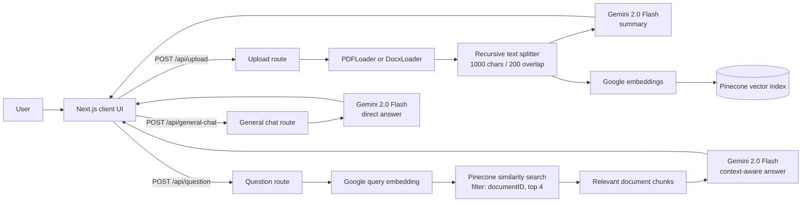

# Docs Assistant

Docs Assistant is a web application for understanding documents through natural-language conversation. A user can upload a PDF or DOCX file, receive an AI-generated summary, and ask follow-up questions grounded in the uploaded document. The application also provides a general-purpose chat mode when no document is selected.

## Problem Statement

Long documents are difficult to search and understand quickly. Users often need to locate a specific fact, clause, or explanation without reading an entire file or manually searching through multiple pages. Docs Assistant addresses this problem by:

- Accepting PDF and DOCX uploads through a drag-and-drop interface.
- Extracting and splitting document text into searchable chunks.
- Generating a structured summary with Google Gemini.
- Creating embeddings and storing chunks in Pinecone for semantic search.
- Retrieving relevant chunks when a user asks a document-specific question.
- Generating an answer from the retrieved context instead of sending the whole document to the model.

## Features

- PDF and DOCX upload with a 20 MB client-side size limit.
- AI-generated document summary after upload.
- Document-grounded question answering using retrieval-augmented generation (RAG).
- General AI chat without an uploaded document.
- Markdown rendering with GitHub-flavored Markdown, syntax highlighting, mathematical notation, emoji, heading links, and sanitization.
- Light and dark themes.
- Chat history for the current browser session and a clear-history action.

## Architecture



### Request flow

1. The browser sends the selected file to `/api/upload` as `multipart/form-data`.
2. The upload route parses the file, creates a UUID, and adds that UUID to every chunk's metadata.
3. Gemini summarizes the first extracted document section, while Google embeddings represent all chunks as vectors.
4. Pinecone stores the vectors and metadata. The returned document ID connects the UI to those stored chunks.
5. A document question is embedded and used for similarity search. The search is filtered by the document ID so results come from the selected document.
6. The retrieved chunks and question are sent to Gemini to produce the final answer.

## Technology Stack

| Technology | Purpose | Why it is used |
| --- | --- | --- |
| Next.js 15 | Full-stack React framework and API routes | Keeps the web UI and server endpoints in one application with a straightforward deployment model. |
| React 19 + TypeScript | Interactive UI and static typing | Supports component-based stateful interfaces and catches type errors during development. |
| Tailwind CSS 4 | Styling and responsive layout | Enables consistent utility-based styling without maintaining a large custom stylesheet. |
| LangChain | Document loading, splitting, embeddings, and vector-store integration | Provides standard building blocks for the RAG pipeline. |
| Google Gemini 2.0 Flash | Summarization and answer generation | Provides fast general-purpose language generation for summaries and chat answers. |
| Google `embedding-001` | Text and query embeddings | Converts document chunks and questions into vectors that can be compared semantically. |
| Pinecone | Vector database | Stores embeddings and supports similarity search with document metadata filtering. |
| `react-dropzone` | File selection and drag-and-drop | Provides a clear upload interaction and client-side file validation. |
| `react-markdown` and remark/rehype plugins | Rich answer and summary rendering | Displays structured AI responses while sanitizing rendered content. |
| Radix UI and Lucide React | Accessible UI primitives and icons | Provides reusable interaction primitives and consistent visual controls. |
| `next-themes` | Theme switching | Supports light, dark, and system theme preferences. |

## Core Concepts Used

### Retrieval-Augmented Generation (RAG)

The document question route first retrieves relevant chunks from Pinecone, then gives those chunks to Gemini as context. This helps keep answers tied to the uploaded document.

### Text chunking

Documents are split into chunks of up to 1,000 characters with 200 characters of overlap. Chunking makes large documents searchable and overlap helps preserve context that crosses chunk boundaries.

### Embeddings and semantic search

Embeddings represent text as numerical vectors. Pinecone compares the question vector with stored document vectors, returning the four most similar chunks rather than relying only on exact keyword matches.

### Metadata filtering

Each chunk receives a generated `documentID`. The question route filters Pinecone results using that ID so a question about one upload does not retrieve chunks belonging to another upload.

### Client and server separation

The page and chat interface manage UI state in the browser. API routes keep model calls, document parsing, API keys, and vector database access on the server.

### Markdown processing and sanitization

AI responses are rendered as Markdown with GFM, math, code highlighting, heading links, and emoji support. `rehype-sanitize` is included to reduce the risk of unsafe HTML in generated content.

## Prerequisites

- Node.js 18.18 or newer (Node.js 20+ is recommended for Next.js 15).
- npm.
- A Google AI API key with access to Gemini and embeddings.
- A Pinecone account, API key, and index configured for the embedding model.

## Environment Variables

Create `.env.local` in the project root:

```env
GOOGLE_API_KEY=your_google_ai_api_key
PINECONE_API_KEY=your_pinecone_api_key
PINECONE_INDEX_NAME=your_pinecone_index_name
```

Do not commit `.env.local` or expose these values in client-side code. Environment files are excluded by `.gitignore`.

## Installation and Local Development

```bash
git clone https://github.com/AkshayPratapSingh333/chatdocsapp.git
cd chatdocsapp
npm install
```

Add the environment variables above, then start the development server:

```bash
npm run dev
```

Open [http://localhost:3000](http://localhost:3000) in a browser.

## Production Build

```bash
npm run build
npm run start
```

The production server is available at [http://localhost:3000](http://localhost:3000) unless another port is configured.

## API Endpoints

### `POST /api/upload`

Accepts a `file` field in `multipart/form-data`. The current UI supports PDF and DOCX files. Returns a summary, generated `documentID`, and extracted page/document count.

### `POST /api/question`

Accepts JSON with `question` and `documentID`. It performs filtered Pinecone similarity search and returns an answer based on the retrieved document chunks.

```json
{
  "question": "What is the main purpose of this document?",
  "documentID": "uploaded-document-id"
}
```

### `POST /api/general-chat`

Accepts JSON with a non-empty `question` and sends it directly to Gemini without document retrieval.

```json
{
  "question": "Explain the difference between encryption and hashing."
}
```

## Project Structure

```text
src/
  app/
    page.tsx                    Main upload, summary, and chat screen
    layout.tsx                  Root layout, metadata, fonts, and theme provider
    api/
      upload/route.ts           Parse, summarize, embed, and index documents
      question/route.ts         Retrieve document context and answer questions
      general-chat/route.ts     Answer questions without document context
  components/
    chat-interface.tsx          Chat state, input, message history, and rendering
    theme-provider.tsx           next-themes provider
    theme-toggle.tsx             Light/dark mode control
    ui/                          Reusable button, card, input, and scroll components
  lib/
    types.ts                    Document and chat message types
    utils.ts                    Shared class-name utility
```

## Current Limitations

- Uploaded documents are indexed in Pinecone, but there is no database-backed upload history or user authentication.
- The document ID is held in client state and is lost on a full page refresh.
- The upload route creates the summary from the first extracted chunk rather than the complete document.
- The API relies on environment variables being present; missing credentials result in request failures.
- The client accepts a 20 MB file limit, but the server does not currently perform a separate file-type and size validation step.

## Useful Commands

```bash
npm run dev       # Start the development server
npm run build     # Create a production build
npm run start     # Run the production build
npm run lint      # Run the configured lint script
```
